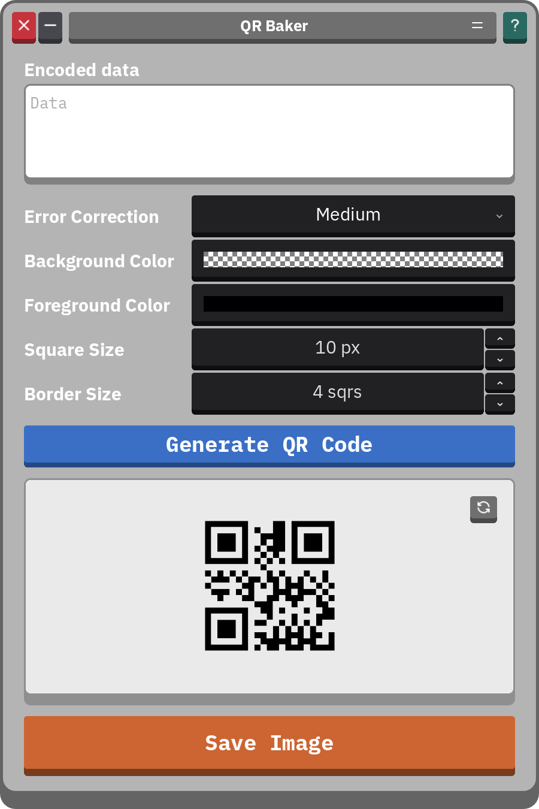

<h3 align="center" >
  <!--
  itch color: #fa5c5c
  github color: brightgreen
  label color: #505050
  mastodon color: #6364FF
  -->

  

    
    
  

   
  
  <h3 align="center">
   <code>QR Baker</code>
  </h3>
  <h6 align="center">
    a multi-platform QR code 
    generator built with Godot 4
  </h6>
  <h6 align="center">
    by <a href="https://nickesc.github.io">N. Escobar</a> / <a href="https://github.com/nickesc">nickesc</a>
      
    
  </h6>
  
</h3>

## Overview

**QR Baker** is an easy-to-use QR code generator, built from the ground up to work on as many systems as possible.

  

The main goal of **QR Baker** is to make it easy to open the app, make a QR code, then save it. It shouldn't take ads, or an internet connection, or a watermark, or in-app purchases, or an account, or a battle pass to make a QR code.

> [!TIP]
> To move the window, click-and-drag the grey  button in the menu bar on platforms where it's supported.

Download installable builds from the [Releases](https://github.com/nickesc/qr-baker/releases) page, or open the web build by clicking below:

  

## Supported Platforms:

These platforms are currently supported, with builds available on the [Releases](https://github.com/nickesc/qr-baker/releases) page:

### Desktop
- [x] macOS (`universal`)
- [x] Windows (`arm64` and `x86_64`)
- [x] Linux (`arm64` and `x86_64`)

### Mobile
- [x] Android (`universal`, `arm` and `x86`)
- [x] iOS

### Other
- [x] Web

> [!WARNING] 
> QR Baker is untested on some architectures: 
> - macOS for `Intel`/`x86_64` processors
> - Windows for `x86_64` processors
> - Linux for `x86_64` processors
> - Android for `x86` processors
>
> Web build is known to have issues on iOS.

## Credits

### Plugins

#### [QR Code](https://godotengine.org/asset-library/asset/2090)
> - Created by [Iceflower](https://godotengine.org/asset-library/asset?user=Iceflower) ([GitHub](https://github.com/kenyoni-software))
> 
> Source code: [`kenyoni-software/godot-addons`](https://github.com/kenyoni-software/godot-addons/tree/main/addons/qr_code)
> 
> License: [MIT](https://github.com/kenyoni-software/godot-addons/blob/main/LICENSE.md)
>

> [!NOTE]
> QR Baker is heavily based around the [QR Code](https://godotengine.org/asset-library/asset/2090) Godot plugin.

#### [iOS Share Plugin](https://godotengine.org/asset-library/asset/2907)
> - Created by [cengiz-pz](https://godotengine.org/asset-library/asset?user=cengiz-pz) ([GitHub](https://github.com/cengiz-pz))
> 
> Source code: [`cengiz-pz/godot-ios-share-plugin`](https://github.com/cengiz-pz/godot-ios-share-plugin)
> 
> License: [MIT](https://github.com/cengiz-pz/godot-ios-share-plugin/blob/main/LICENSE)

### Icons

#### [Tabler Icons](https://tabler.io/icons)
> - Created by [Tabler](https://tabler.io/) ([Github](https://github.com/tabler))
>
> Source code: [`tabler/tabler-icons`](https://github.com/tabler/tabler-icons)
> 
> License: [MIT](https://github.com/tabler/tabler-icons/blob/main/LICENSE)

### Fonts

#### [IBM Plex](https://www.ibm.com/plex/)
> [IBM Plex Sans](https://mikeabbink.com/typefaces/ibm-plex-sans/) and [IBM Plex Mono](https://mikeabbink.com/typefaces/ibm-plex-mono/)
>
> - Designed by [Mike Abbink](https://mikeabbink.com) in collaboration with [Bold Monday](https://www.boldmonday.com/) for [IBM](https://ibm.com)
>
> Source code: [`IBM/plex`](https://github.com/IBM/plex)
> 
> License: [OFL-1.1](https://github.com/IBM/plex/blob/master/LICENSE.txt)

## License

QR Baker is released under the **MIT** license. For more information, see the repository's [LICENSE](/LICENSE) file.
